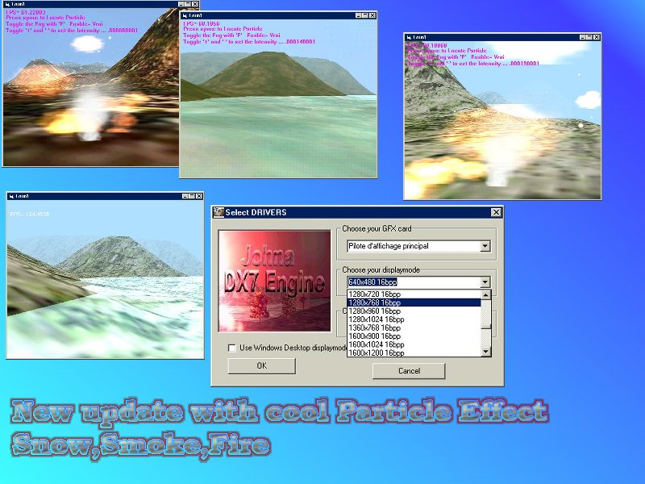



## JohnaDX7 3d engine \(update code can fully be compiled all bug fixed\)

### Description

Now i have fixed all bugs

the code can be compiled for more speed

T&T deviced are now detected and can be used

for transform and lighting

For people that don't know this engine

JohnaDX7 is a 3d engine that could help in 3d game programming

it allows you to load Mesh from files,translate,rotate,scale them and handle Axis Aligned Bounding Box for cool and accurate collision detection

It has also a 3sound engine for playing sound on 3d space,also SkyDome,skybox,landscape engine,fog,transparency,single pass multitexturing

and many features....

So check it out at the main engine submission at this link:

http://www.planetsourcecode.com/vb/scripts/ShowCode.asp?txtCodeId=33002&lngWId=1

PLEASE VOTE AT THIS SAME LINK and LEAVE FEEDBACKS
 
### More Info
 

             |
---                |---
**Submitted On**   |2002-03-23 23:47:26
**By**             |[polaris](https://github.com/Planet-Source-Code/PSCIndex/blob/master/ByAuthor/polaris.md)
**Level**          |Advanced
**User Rating**    |3.7 (11 globes from 3 users)
**Compatibility**  |VB 4\.0 \(32\-bit\), VB 5\.0, VB 6\.0
**Category**       |[DirectX](https://github.com/Planet-Source-Code/PSCIndex/blob/master/ByCategory/directx__1-44.md)
**World**          |[Visual Basic](https://github.com/Planet-Source-Code/PSCIndex/blob/master/ByWorld/visual-basic.md)
**Archive File**   |[JohnaDX7\_3665243292002\.zip](https://github.com/Planet-Source-Code/polaris-johnadx7-3d-engine-update-code-can-fully-be-compiled-all-bug-fixed__1-33194/archive/master.zip)

